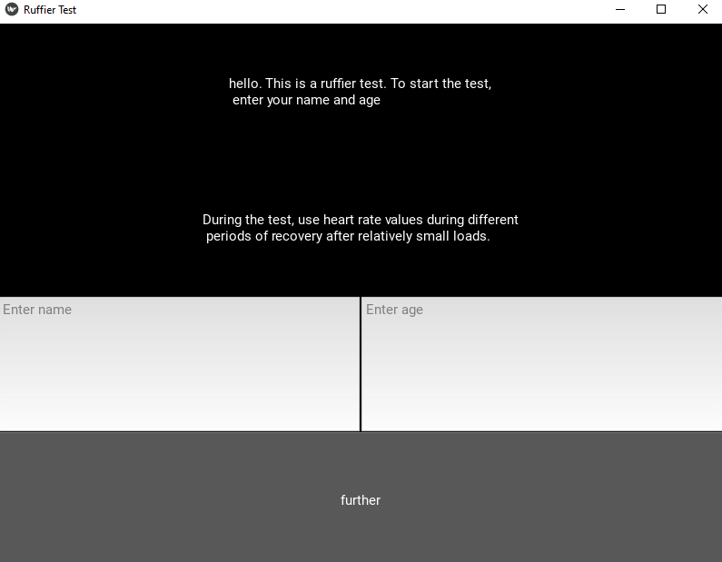

# Ruffier test app

This is an application written in Python using the kiwi library. Here you can take a ruffier test and check your health.

## Application Description

In this app, you can check your health. First, you need to write your name and age. Then, you need to enter your heart rate and follow the instructions. After completing the test, you will receive a result. 

## Requirements

- Python
- Kivi library

